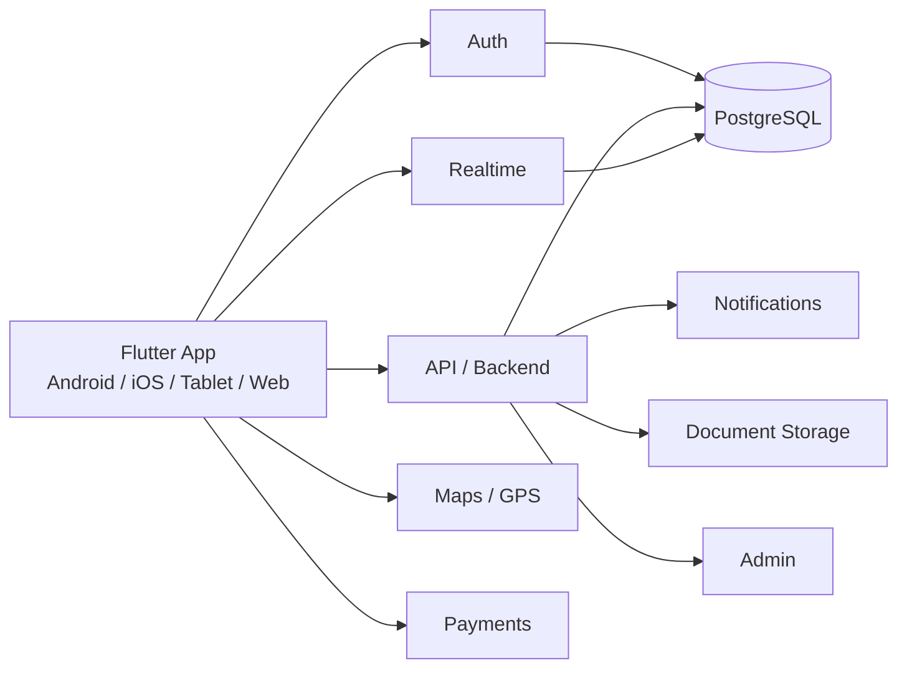

# Arquitectura propuesta

## Capas
1. **Cliente Flutter**
   - Pasajero
   - Conductor
   - Administrador web

2. **Backend**
   - autenticación
   - roles/permisos
   - matching de viajes
   - cálculo de tarifa
   - comisión
   - wallet
   - documentos
   - alertas

3. **Tiempo real**
   - posición del conductor
   - estado del viaje
   - aceptación/cancelación
   - chat
   - SOS

4. **Persistencia**
   - PostgreSQL
   - almacenamiento de documentos e imágenes

## Principio
El teléfono no debe decidir datos sensibles como comisión, saldo o estado final del pago.
Esas reglas deben validarse en backend.
