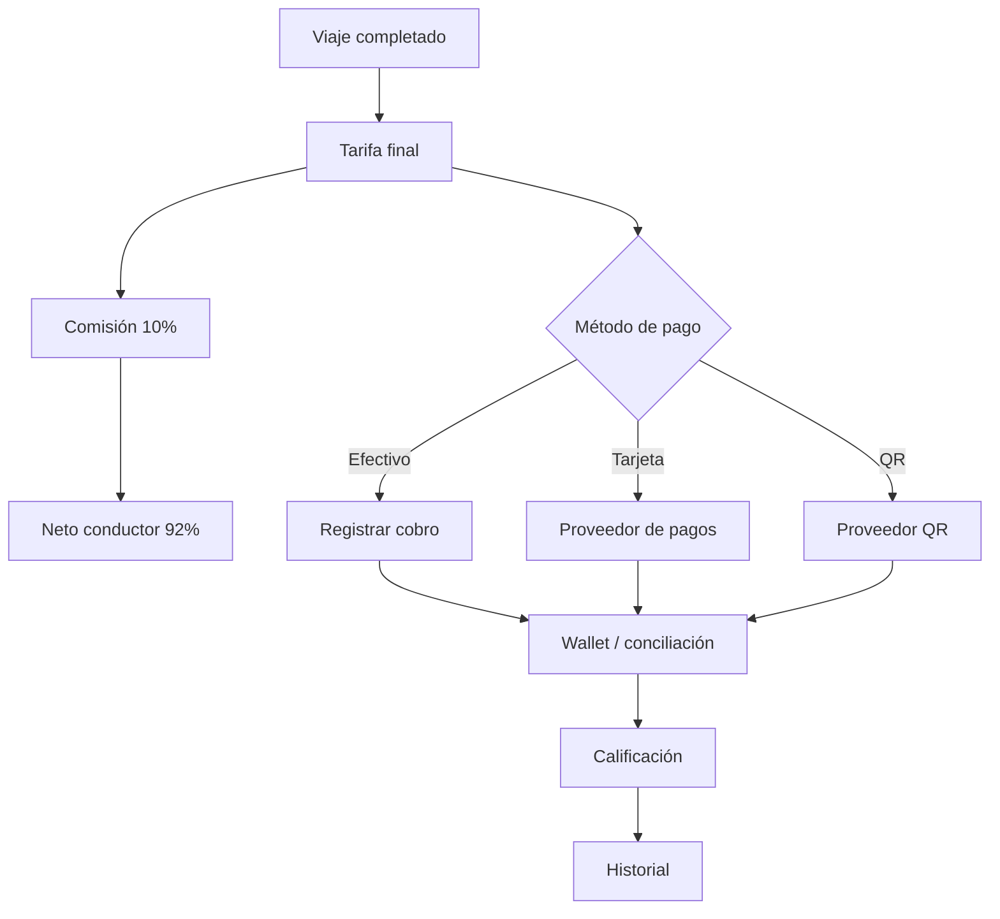

# Flujo de pago

```mermaid
flowchart TD
    A[Viaje completado] --> B[Tarifa final]
    B --> C[Comisión 10%]
    C --> D[Neto conductor 92%]
    B --> E{Método de pago}
    E -->|Efectivo| F[Registrar cobro]
    E -->|Tarjeta| G[Proveedor de pagos]
    E -->|QR| H[Proveedor QR]
    F --> I[Wallet / conciliación]
    G --> I
    H --> I
    I --> J[Calificación]
    J --> K[Historial]
```

## Regla crítica
El cliente móvil nunca debe decidir el importe definitivo de la comisión,
el neto del conductor ni el estado final de una transacción financiera.
