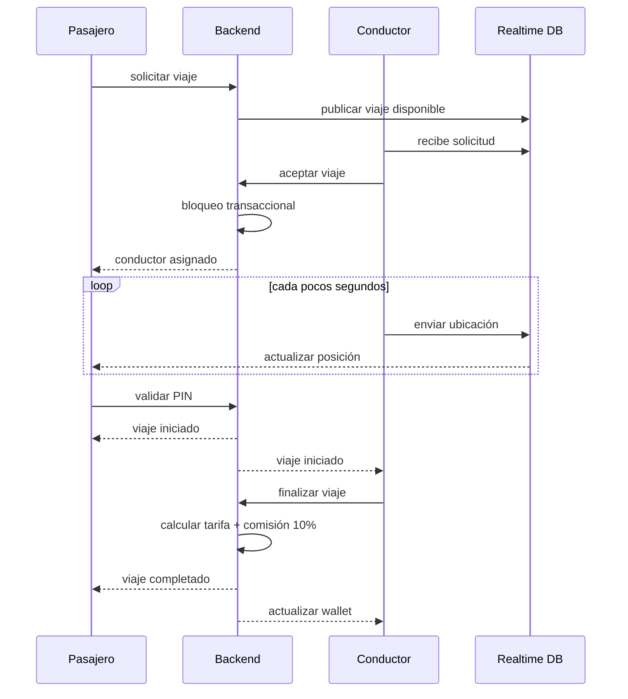

# Diagrama de seguimiento en tiempo real

```mermaid
sequenceDiagram
    participant P as Pasajero
    participant API as Backend
    participant D as Conductor
    participant RT as Realtime DB

    P->>API: solicitar viaje
    API->>RT: publicar viaje disponible
    D->>RT: recibe solicitud
    D->>API: aceptar viaje
    API->>API: bloqueo transaccional
    API-->>P: conductor asignado

    loop cada pocos segundos
        D->>RT: enviar ubicación
        RT-->>P: actualizar posición
    end

    P->>API: validar PIN
    API-->>P: viaje iniciado
    API-->>D: viaje iniciado

    D->>API: finalizar viaje
    API->>API: calcular tarifa + comisión 10%
    API-->>P: viaje completado
    API-->>D: actualizar wallet
```
