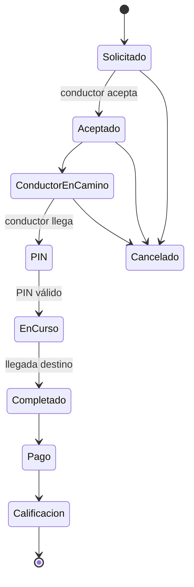

# Flujo de viaje

## Datos visibles al pasajero tras aceptación
- nombre del conductor
- foto
- moto
- placa
- número económico
- sindicato
- calificación
- ubicación en tiempo real

## Seguridad
- PIN de inicio
- SOS
- compartir viaje
- registro de eventos críticos
